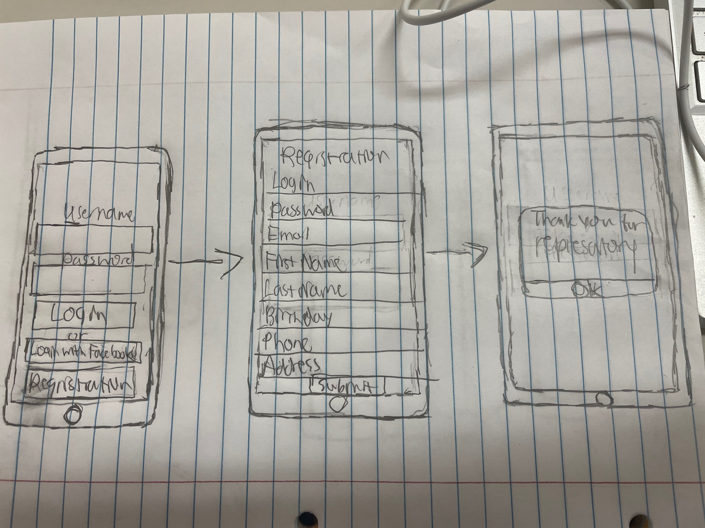

# drivePro

## Table of Contents
1. [Overview](#Overview)
1. [Product Spec](#Product-Spec)
1. [Wireframes](#Wireframes)
2. [Schema](#Schema)

## Overview
### Description
drivePro will allow users to compare prices from various rental car enterprises and choose the best option.

### App Evaluation

- **Category: Productivity**
- **Mobile: Android**
- **Story: Tired of paying too much? Wanted a better rental car but couldn't afford it? View all of your options easily here!**
- **Market: Renters trying to be efficient and save money.**
- **Habit: Users can save deals to compare and get notified before the prices rise.**
- **Scope: Users will soon be able to book hotels/flights with great deals in accordance with their transportation.**

## Product Spec

### 1. User Stories (Required and Optional)

**Required Must-have Stories**

- [X] Creation of GitHub Organization and Group Project Repo (1pt)
- [X] App Overview: Description and evaluation (Mobile, Story, Market, Habit & Scope)
- [X] App spec: user stories, screens & navigation flows
- [X] Wireframe images 
- [X] Updated group info in the Course Portal: Group Name + App Description. 

**Optional Nice-to-have Stories**

- [ ] Digital Wireframe/Mockup Images 
- [ ] Interactive Prototype gif

<!-- ### 2. Screen Archetypes

* [list first screen here]
   * [list associated required story here]
   * ...
* [list second screen here]
   * [list associated required story here]
   * ...
--> 
### 2. Navigation

**Tab Navigation** (Tab to Screen)

* Home
* Reservations
* Search

**Flow Navigation** (Screen to Screen)

<image src="WireFrame 2.jpeg" width=600>

## Wireframes

### [BONUS] Digital Wireframes & Mockups

### [BONUS] Interactive Prototype

## Schema 
### Models
#### Registration

   | Property      | Type     | Description |
   | ------------- | -------- | ------------|
   | firstName     | String   | first name for vehicle registration |
   | lastName      | String   | last name for  |
   | Date of Birth | Date     | registrar's DOB to authenticate age validity |
   | Home Address  | String   | location of registrar in case of accident  |
   | Email         | Email    | primary mode of contact |
   | Phone         | Number     | secondary mode of contact |
   
#### Vehicle

   | Property      | Type     | Description |
   | ------------- | -------- | ------------|
   | objectId      | String   | unique id for the specified vehicle |
   | Make          | String   | car manufacturer |
   | Model         | String   | model of car  |
   | Year          | Number   | year the car was manufactured |
   | Price Per Day | Number   | cost to rent the vehicle per day |
   | Our Rating    | Number   | how does this vehicle's quality and price per day compare to others like it |
   | Similar Vehicles  | Image | vehicles of similar size (compact, mid-size, full-size) |
   
#### Rental Agency
  
   | Property      | Type     | Description |
   | ------------- | -------- | ------------|
   | Company       | String   | name of rental agency |
   | Location      | String   | physical address to pick up the car |
   | Age Requirement  | String   | how old you have to be to rent from this agency  |
   | Fees          | Number   | payments in addition to price per day |
   | Company Phone Number | Number   | primary mode of contact |
   | Company Email    | Email  | secondary mode of contact |
   
   
### Networking
- [Add list of network requests by screen ]
- [Create basic snippets for each Parse network request]
- [OPTIONAL: List endpoints if using existing API such as Yelp]

## Schema 

### Networking
